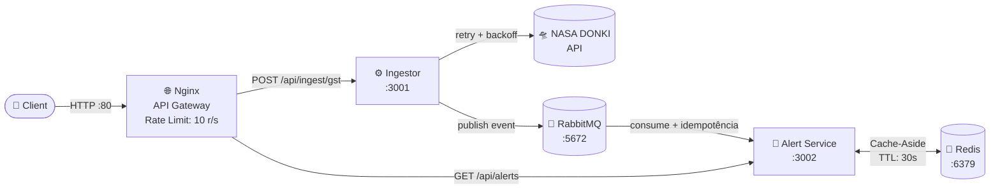

# 🛡️ Solar Shield

Sistema de microsserviços que ingere dados reais da NASA (DONKI), classifica tempestades geomagnéticas e dispara alertas para operadores de infraestrutura crítica.

**Global Solution 2026.1 · FIAP · Microservice and Web Engineering**

---

## Arquitetura



---

## Serviços

| Serviço | Porta | Responsabilidade |
|---------|-------|-----------------|
| `ingestor` | 3001 | Busca dados da NASA DONKI, classifica severidade (RN1) e publica no RabbitMQ |
| `alert-service` | 3002 | Consome a fila, aplica idempotência por `event_id` (RN3) e expõe os alertas |
| `nginx` | 80 | API Gateway — proxy reverso com rate limiting (10 req/s) |
| `rabbitmq` | 5672 / 15672 | Broker de mensagens (producer + consumer) |
| `redis` | 6379 | Cache com TTL para o endpoint de alertas |

---

## Cache TTL

O endpoint `GET /api/alerts` usa o padrão **Cache-Aside** com TTL de **30 segundos**. Justificativa: eventos de clima espacial do NASA DONKI são atualizados em intervalos de horas, portanto 30 segundos reduz significativamente a carga no serviço sem expor dados desatualizados ao operador.

---

## Como rodar

### Pré-requisitos

- Docker
- Docker Compose

### Subir a infraestrutura

```bash
git clone <url-do-repositorio>
cd solar-shield
docker-compose up --build
```

> Aguarde ~20s para o RabbitMQ inicializar completamente antes de disparar requisições.

---

## Endpoints

| Método | Rota | Serviço | Descrição |
|--------|------|---------|-----------|
| `POST` | `/api/ingest/gst` | ingestor | Busca eventos GST da NASA (últimos 7 dias) e publica na fila |
| `GET` | `/api/alerts` | alert-service | Lista os alertas classificados (com cache Redis) |

### Exemplos de uso

```bash
# 1. Disparar ingestão da NASA
curl -X POST http://localhost/api/ingest/gst

# 2. Consultar alertas — primeira chamada (cache MISS)
curl http://localhost/api/alerts

# 3. Consultar novamente — segunda chamada (cache HIT)
curl http://localhost/api/alerts
```

Observe no log do `alert-service` as linhas `cache HIT` e `cache MISS`.

---
